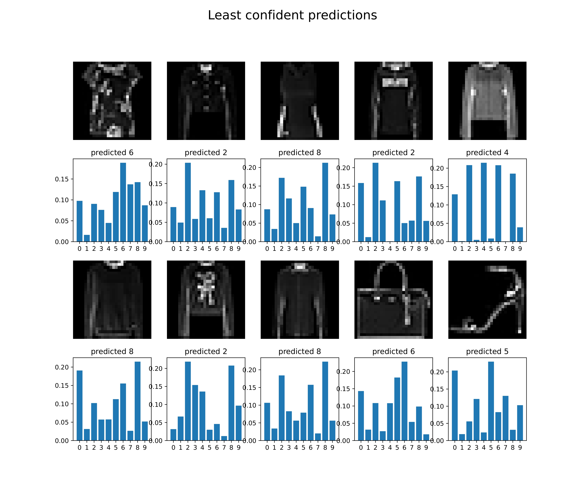
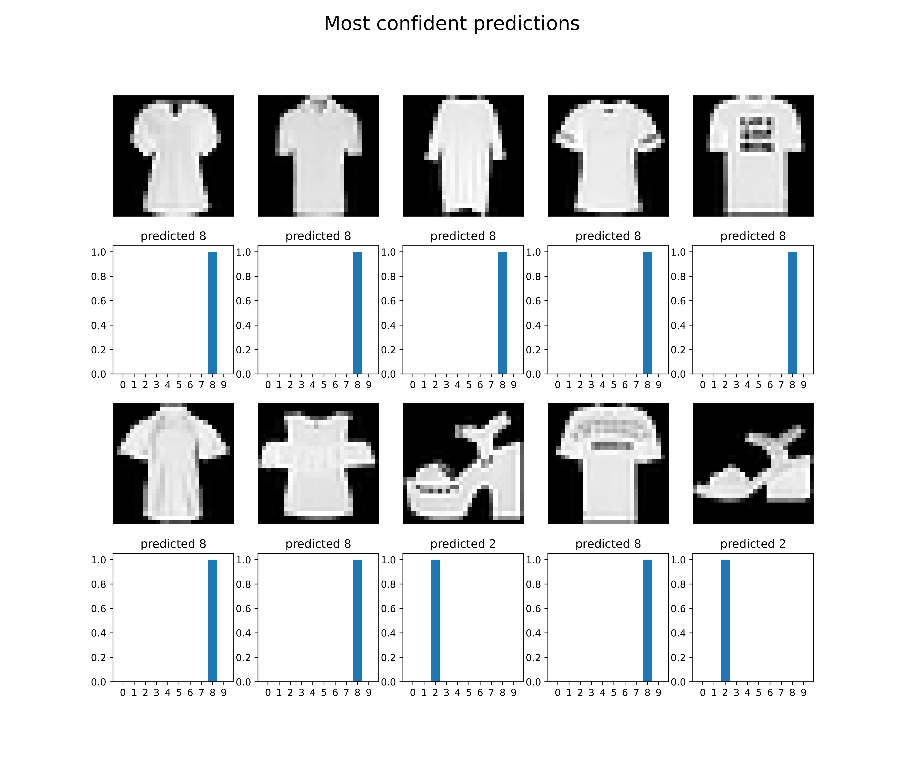
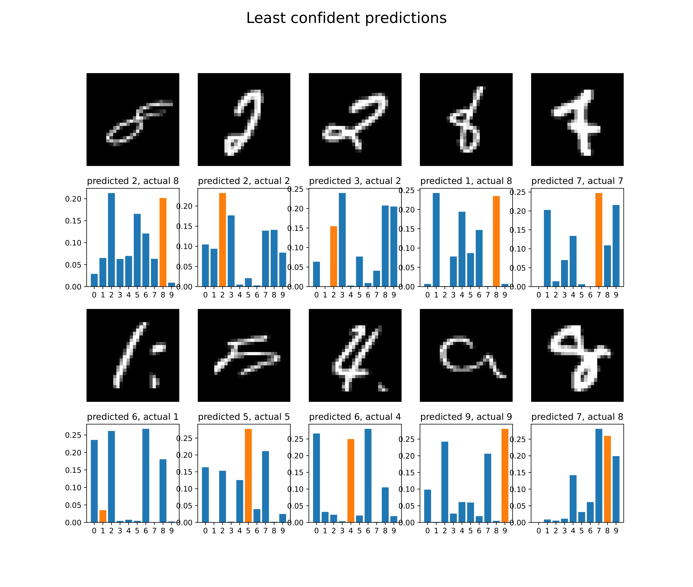
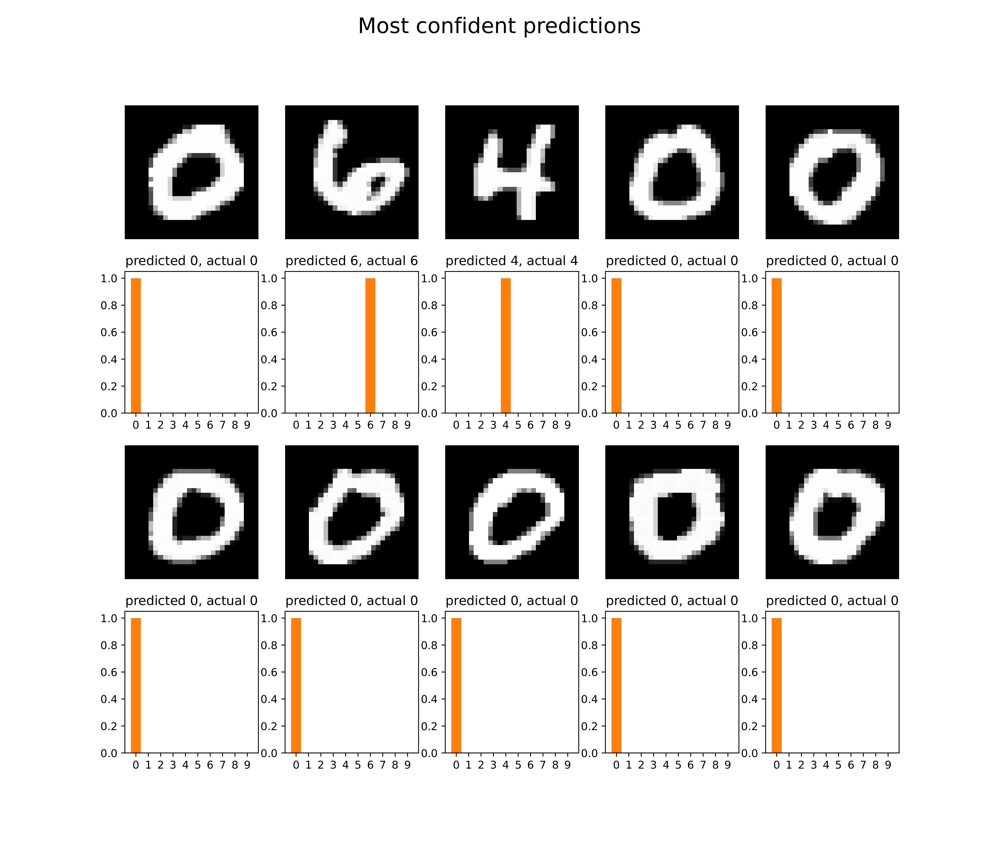

# OOD Detection Using DenseNet and BayesNet

This repository contains implementations of DenseNet and BayesNet architectures for Out-of-Distribution (OOD) detection. The models are evaluated on MNIST and FashionMNIST datasets, with detailed analysis provided.

## Results

### DenseNet
- **AUROC** for MNIST vs. FashionMNIST OOD detection based on confidence: **0.505**
- **AUPRC** for MNIST vs. FashionMNIST OOD detection based on confidence: **0.856**

### BayesNet
- **AUROC** for MNIST vs. FashionMNIST OOD detection based on confidence: **0.851**
- **AUPRC** for MNIST vs. FashionMNIST OOD detection based on confidence: **0.971**

## Visualization

The following images provide insights into the models' predictions:

### Ambiguous Rotated MNIST Model Predictions


### FashionMNIST Least Confident Predictions


### FashionMNIST Most Confident Predictions


### MNIST Least Confident Predictions


### MNIST Most Confident Predictions


## Features

- **DenseNet**: A traditional feedforward neural network with ReLU activation.
- **BayesNet**: A Bayesian neural network implemented using Bayes by Backprop for uncertainty estimation.
- **Evaluation Metrics**: AUROC and AUPRC for OOD detection.
- **Confidence Visualization**: Displays most and least confident predictions for MNIST and FashionMNIST datasets.

## Prerequisites

To run this project, you need the following Python packages:

- `numpy`
- `torch`
- `torchvision`
- `matplotlib`
- `tqdm`
- `sklearn`

Install the dependencies using:

```bash
pip install numpy torch torchvision matplotlib tqdm sklearn
```

## Usage

1. Place your training and evaluation datasets in the appropriate format (e.g., `train_data.npz`, `test_x.npz`, and `fmnist.npz`).
2. Run the main script:

```bash
python solution.py
```

3. Enable extended evaluation by setting `EXTENDED_EVALUATION = True` in the script to generate additional visualizations.

## File Structure

- `solution.py`: Main script containing the implementations of DenseNet and BayesNet, along with evaluation functions.
- `ambiguous_rotated_mnist.pdf`: Visualization of ambiguous MNIST predictions.
- `fashionmnist_least_confident.pdf`: Least confident predictions on FashionMNIST.
- `fashionmnist_most_confident.pdf`: Most confident predictions on FashionMNIST.
- `mnist_least_confident.pdf`: Least confident predictions on MNIST.
- `mnist_most_confident.pdf`: Most confident predictions on MNIST.

## Author

This repository was created to explore the use of neural networks for OOD detection and uncertainty quantification in image classification tasks.
